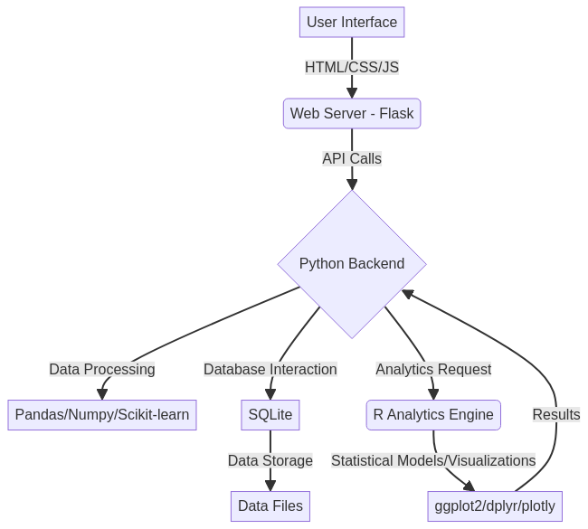
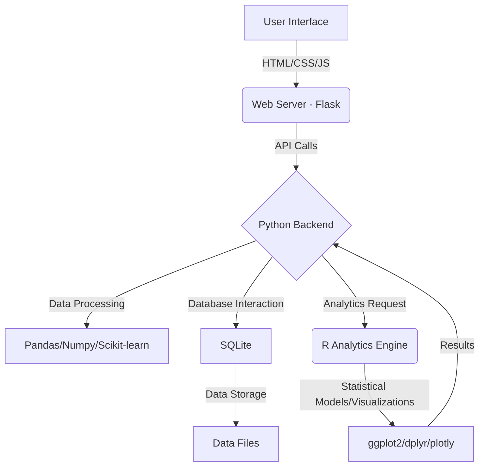
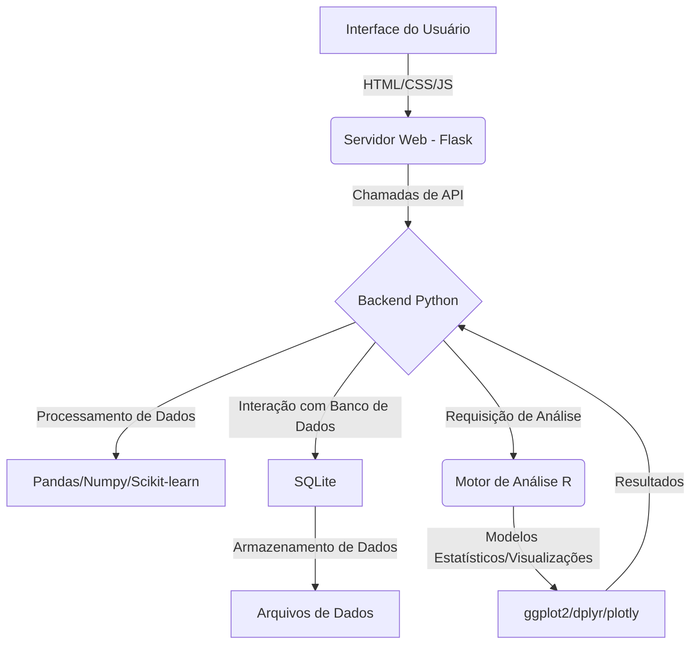

# AI-Chatbot-Framework

<!-- 🖼️ Imagem Hero Placeholder -->



## English

### Overview
This project presents an advanced AI Chatbot Framework, meticulously designed and developed by Gabriel Demetrios Lafis. It offers comprehensive functionality, a modern technology stack, and a focus on scalability and performance. The framework integrates multiple programming languages, interactive web interfaces, and sophisticated analytics capabilities to deliver professional-grade solutions for conversational AI.

### Author
**Gabriel Demetrios Lafis**
- Email: gabrieldemetrios@gmail.com
- LinkedIn: [Gabriel Demetrios Lafis](https://www.linkedin.com/in/gabriel-demetrios-lafis-62197711b)
- GitHub: [galafis](https://github.com/galafis)

### Badges
[](https://www.python.org/)
[](https://flask.palletsprojects.com/)
[](https://developer.mozilla.org/en-US/docs/Web/JavaScript)
[](https://html.spec.whatwg.org/multipage/)
[](https://www.w3.org/Style/CSS/)
[](https://www.r-project.org/)
[](./config/LICENSE)

### Technologies Used
This framework leverages a robust set of technologies to ensure high performance, flexibility, and maintainability:

-   **Backend**: Python (Flask, FastAPI for potential future expansion), SQLite for local data storage.
-   **Frontend**: Modern web standards including HTML5, CSS3 (with Grid and Flexbox for responsive design), and JavaScript (ES6+) for interactive elements.
-   **Analytics**: R for advanced statistical analysis, data visualization (ggplot2, dplyr, corrplot, plotly), and comprehensive reporting.
-   **Data Processing**: Python libraries such as pandas, numpy, and scikit-learn for efficient data manipulation and machine learning tasks.
-   **Development Tools**: Git for version control, GitHub for repository hosting.

### Architecture Diagram


### Features

#### Core Functionality
-   **Advanced Data Processing**: High-performance algorithms for efficient data handling and transformation.
-   **Real-time Analytics**: Capabilities for live data analysis and dynamic visualization, providing immediate insights.
-   **Interactive Web Interface**: A modern, responsive, and intuitive user interface designed for seamless interaction across various devices.
-   **Comprehensive Statistical Analysis**: Integration with R for robust statistical modeling, hypothesis testing, and detailed reporting.
-   **Scalable Architecture**: Engineered for enterprise-level performance and future expansion, supporting multi-threading and memory optimization.

#### Web Interface
-   **Modern UI/UX**: Semantic HTML5 markup combined with accessible design principles.
-   **Responsive Design**: Utilizes CSS3 features like Grid and Flexbox for optimal viewing on desktops, tablets, and mobile devices.
-   **Dynamic Interactivity**: Enhanced with JavaScript ES6+ and modern Web APIs for rich, interactive user experiences.
-   **Real-time Updates**: Dynamic content loading and live data visualization for up-to-the-minute information.
-   **Professional Styling**: Custom CSS animations and transitions for a polished and engaging aesthetic.

#### Analytics & Reporting
-   **R Integration**: Deep integration with R for advanced statistical computations and data visualization.
-   **Automated Data Processing**: Features for automated data cleaning, transformation, and preparation for analysis.
-   **Interactive Visualizations**: Generation of interactive charts, graphs, and comprehensive dashboards for clear data representation.
-   **Performance Metrics**: Real-time monitoring and analytical reporting on system performance and chatbot effectiveness.
-   **Flexible Export Options**: Support for exporting reports and data in multiple formats (e.g., JSON, CSV, PDF).

### Installation
To set up the AI Chatbot Framework locally, follow these steps:

1.  **Clone the repository**:
    ```bash
    git clone https://github.com/galafis/AI-Chatbot-Framework.git
    cd AI-Chatbot-Framework
    ```

2.  **Set up the Python environment**:
    ```bash
    python -m venv venv
    source venv/bin/activate  # On Windows: .\venv\Scripts\activate
    pip install -r config/requirements.txt
    ```

3.  **Set up the R environment** (install required packages):
    Open an R console or run the following command:
    ```R
    install.packages(c('ggplot2', 'dplyr', 'corrplot', 'plotly'))
    ```

### Usage

#### Running the Application
To start the Flask web server:

```bash
python src/app.py
```
Once the server is running, open your web browser and navigate to `http://localhost:5000` to access the chatbot interface.

#### Accessing the Web Interface Directly
For direct frontend interaction, you can open `src/index.html` in your web browser. This provides the interactive dashboard with real-time functionality and responsive design.

#### Performing Analytics
To execute the R-based statistical analysis:

1.  Ensure your R environment is set up as described in the installation section.
2.  You can run the analytics script from your Python application or directly from R:
    ```R
    # Load R analytics script
    source('src/analytics.R')
    
    # Example: Create a DataAnalyzer instance and perform analysis
    analyzer <- DataAnalyzer$new()
    analyzer$load_data('assets/data/sample_data.csv') # Assuming sample_data.csv exists
    analyzer$analyze()
    analyzer$generate_report()
    ```

### File Structure
```
AI-Chatbot-Framework/
├── assets/                 # Static assets like images, data files
│   └── data/               # Sample data for analytics
├── config/                 # Configuration files and project metadata
│   ├── LICENSE             # Project license
│   ├── package.json        # Frontend dependencies (if any)
│   └── requirements.txt    # Python dependencies
├── docs/                   # Documentation and additional resources
├── src/                    # Source code for the application
│   ├── app.js              # JavaScript for frontend interactivity
│   ├── app.py              # Main Python Flask application
│   ├── analytics.R         # R scripts for statistical analysis
│   ├── chatbot.css         # CSS for chatbot specific styling
│   ├── chatbot.html        # HTML for chatbot interface
│   ├── chatbot.js          # JavaScript for chatbot logic
│   ├── index.html          # Main web interface HTML
│   └── styles.css          # Global CSS styling
├── tests/                  # Unit and integration tests
└── README.md               # Project documentation (this file)
```

### API Endpoints
The Flask application exposes the following API endpoints:

| Method | Endpoint            | Description                               |
| :----- | :------------------ | :---------------------------------------- |
| `GET`  | `/`                 | Serves the main web interface.            |
| `POST` | `/api/process`      | Handles data processing requests.         |
| `GET`  | `/api/analytics`    | Retrieves the results of data analytics.  |
| `POST` | `/api/upload`       | Facilitates file uploads to the server.   |
| `GET`  | `/api/status`       | Provides current system status.           |

### Configuration
Key configuration parameters are managed within the application. An example `config.py` (to be created in `config/` directory) would look like:

```python
# config/config.py
APP_CONFIG = {
    'debug': True,
    'host': '0.0.0.0',
    'port': 5000,
    'max_file_size': '16MB'
}

ANALYTICS_CONFIG = {
    'enable_r_integration': True,
    'auto_visualization': True,
    'export_formats': ['json', 'csv', 'pdf']
}
```

### Performance Features
-   **Multi-threading**: Utilizes parallel processing to enhance application responsiveness and throughput.
-   **Intelligent Caching**: Implements caching mechanisms to reduce latency and improve response times for frequently accessed data.
-   **Memory Optimization**: Designed with efficient memory management techniques to minimize resource consumption.
-   **Horizontal Scalability**: Built to support horizontal scaling, allowing the application to handle increased loads by adding more instances.

### License
This project is licensed under the MIT License - see the [LICENSE](./config/LICENSE) file for details.

### Contributions
Contributions are welcome! If you have suggestions, bug reports, or want to contribute code, please open an issue or submit a pull request. Ensure your contributions adhere to the project's coding standards.

### Contact
For any inquiries, support, or collaboration opportunities, please reach out to Gabriel Demetrios Lafis via email or LinkedIn.

---

## Português

<!-- 🖼️ Imagem Hero Placeholder -->


### Visão Geral
Este projeto apresenta um Framework de Chatbot de IA avançado, meticulosamente projetado e desenvolvido por Gabriel Demetrios Lafis. Ele oferece funcionalidade abrangente, uma pilha de tecnologia moderna e um foco em escalabilidade e desempenho. O framework integra múltiplas linguagens de programação, interfaces web interativas e capacidades analíticas sofisticadas para fornecer soluções de nível profissional para IA conversacional.

### Autor
**Gabriel Demetrios Lafis**
- Email: gabrieldemetrios@gmail.com
- LinkedIn: [Gabriel Demetrios Lafis](https://www.linkedin.com/in/gabriel-demetrios-lafis-62197711b)
- GitHub: [galafis](https://github.com/galafis)

### Badges
[](https://www.python.org/)
[](https://flask.palletsprojects.com/)
[](https://developer.mozilla.org/en-US/docs/Web/JavaScript)
[](https://html.spec.whatwg.org/multipage/)
[](https://www.w3.org/Style/CSS/)
[](https://www.r-project.org/)
[](./config/LICENSE)

### Tecnologias Utilizadas
Este framework utiliza um conjunto robusto de tecnologias para garantir alto desempenho, flexibilidade e manutenibilidade:

-   **Backend**: Python (Flask, FastAPI para potencial expansão futura), SQLite para armazenamento de dados local.
-   **Frontend**: Padrões web modernos, incluindo HTML5, CSS3 (com Grid e Flexbox para design responsivo) e JavaScript (ES6+) para elementos interativos.
-   **Análises**: R para análise estatística avançada, visualização de dados (ggplot2, dplyr, corrplot, plotly) e relatórios abrangentes.
-   **Processamento de Dados**: Bibliotecas Python como pandas, numpy e scikit-learn para manipulação eficiente de dados e tarefas de aprendizado de máquina.
-   **Ferramentas de Desenvolvimento**: Git para controle de versão, GitHub para hospedagem de repositório.

### Diagrama de Arquitetura


### Funcionalidades

#### Funcionalidade Principal
-   **Processamento Avançado de Dados**: Algoritmos de alta performance para manipulação e transformação eficiente de dados.
-   **Análises em Tempo Real**: Capacidades para análise de dados ao vivo e visualização dinâmica, fornecendo insights imediatos.
-   **Interface Web Interativa**: Uma interface de usuário moderna, responsiva e intuitiva, projetada para interação perfeita em vários dispositivos.
-   **Análise Estatística Abrangente**: Integração com R para modelagem estatística robusta, teste de hipóteses e relatórios detalhados.
-   **Arquitetura Escalável**: Projetado para desempenho de nível empresarial e expansão futura, suportando multi-threading e otimização de memória.

#### Interface Web
-   **UI/UX Moderna**: Marcação HTML5 semântica combinada com princípios de design acessíveis.
-   **Design Responsivo**: Utiliza recursos CSS3 como Grid e Flexbox para visualização ideal em desktops, tablets e dispositivos móveis.
-   **Interatividade Dinâmica**: Aprimorado com JavaScript ES6+ e APIs Web modernas para experiências de usuário ricas e interativas.
-   **Atualizações em Tempo Real**: Carregamento dinâmico de conteúdo e visualização de dados ao vivo para informações atualizadas.
-   **Estilização Profissional**: Animações e transições CSS personalizadas para uma estética polida e envolvente.

#### Análises e Relatórios
-   **Integração com R**: Integração profunda com R para cálculos estatísticos avançados e visualização de dados.
-   **Processamento Automatizado de Dados**: Recursos para limpeza, transformação e preparação automatizada de dados para análise.
-   **Visualizações Interativas**: Geração de gráficos interativos e dashboards abrangentes para representação clara dos dados.
-   **Métricas de Desempenho**: Monitoramento em tempo real e relatórios analíticos sobre o desempenho do sistema e a eficácia do chatbot.
-   **Opções Flexíveis de Exportação**: Suporte para exportação de relatórios e dados em múltiplos formatos (por exemplo, JSON, CSV, PDF).

### Instalação
Para configurar o AI Chatbot Framework localmente, siga estas etapas:

1.  **Clonar o repositório**:
    ```bash
    git clone https://github.com/galafis/AI-Chatbot-Framework.git
    cd AI-Chatbot-Framework
    ```

2.  **Configurar o ambiente Python**:
    ```bash
    python -m venv venv
    source venv/bin/activate  # No Windows: .\venv\Scripts\activate
    pip install -r config/requirements.txt
    ```

3.  **Configurar o ambiente R** (instalar pacotes necessários):
    Abra um console R ou execute o seguinte comando:
    ```R
    install.packages(c('ggplot2', 'dplyr', 'corrplot', 'plotly'))
    ```

### Uso

#### Executando a Aplicação
Para iniciar o servidor web Flask:

```bash
python src/app.py
```
Uma vez que o servidor esteja em execução, abra seu navegador web e navegue para `http://localhost:5000` para acessar a interface do chatbot.

#### Acessando a Interface Web Diretamente
Para interação direta com o frontend, você pode abrir `src/index.html` em seu navegador web. Isso fornece o dashboard interativo com funcionalidade em tempo real e design responsivo.

#### Realizando Análises
Para executar a análise estatística baseada em R:

1.  Certifique-se de que seu ambiente R esteja configurado conforme descrito na seção de instalação.
2.  Você pode executar o script de análise a partir de sua aplicação Python ou diretamente do R:
    ```R
    # Carregar script de análise R
    source('src/analytics.R')
    
    # Exemplo: Criar uma instância de DataAnalyzer e realizar a análise
    analyzer <- DataAnalyzer$new()
    analyzer$load_data('assets/data/sample_data.csv') # Assumindo que sample_data.csv existe
    analyzer$analyze()
    analyzer$generate_report()
    ```

### Estrutura de Arquivos
```
AI-Chatbot-Framework/
├── assets/                 # Ativos estáticos como imagens, arquivos de dados
│   └── data/               # Dados de exemplo para análises
├── config/                 # Arquivos de configuração e metadados do projeto
│   ├── LICENSE             # Licença do projeto
│   ├── package.json        # Dependências de frontend (se houver)
│   └── requirements.txt    # Dependências Python
├── docs/                   # Documentação e recursos adicionais
├── src/                    # Código fonte da aplicação
│   ├── app.js              # JavaScript para interatividade do frontend
│   ├── app.py              # Aplicação principal Python Flask
│   ├── analytics.R         # Scripts R para análise estatística
│   ├── chatbot.css         # CSS para estilização específica do chatbot
│   ├── chatbot.html        # HTML para interface do chatbot
│   ├── chatbot.js          # JavaScript para lógica do chatbot
│   ├── index.html          # HTML da interface web principal
│   └── styles.css          # Estilização CSS global
├── tests/                  # Testes unitários e de integração
└── README.md               # Documentação do projeto (este arquivo)
```

### Endpoints da API
A aplicação Flask expõe os seguintes endpoints da API:

| Método | Endpoint            | Descrição                               |
| :----- | :------------------ | :---------------------------------------- |
| `GET`  | `/`                 | Serve a interface web principal.          |
| `POST` | `/api/process`      | Lida com requisições de processamento de dados. |
| `GET`  | `/api/analytics`    | Recupera os resultados das análises de dados. |
| `POST` | `/api/upload`       | Facilita o upload de arquivos para o servidor. |
| `GET`  | `/api/status`       | Fornece o status atual do sistema.        |

### Configuração
Os principais parâmetros de configuração são gerenciados dentro da aplicação. Um exemplo de `config.py` (a ser criado no diretório `config/`) seria:

```python
# config/config.py
APP_CONFIG = {
    'debug': True,
    'host': '0.0.0.0',
    'port': 5000,
    'max_file_size': '16MB'
}

ANALYTICS_CONFIG = {
    'enable_r_integration': True,
    'auto_visualization': True,
    'export_formats': ['json', 'csv', 'pdf']
}
```

### Recursos de Performance
-   **Multi-threading**: Utiliza processamento paralelo para aprimorar a responsividade e o throughput da aplicação.
-   **Cache Inteligente**: Implementa mecanismos de cache para reduzir a latência e melhorar os tempos de resposta para dados frequentemente acessados.
-   **Otimização de Memória**: Projetado com técnicas eficientes de gerenciamento de memória para minimizar o consumo de recursos.
-   **Escalabilidade Horizontal**: Construído para suportar escalabilidade horizontal, permitindo que a aplicação lide com cargas aumentadas adicionando mais instâncias.

### Licença
Este projeto está licenciado sob a Licença MIT - veja o arquivo [LICENSE](./config/LICENSE) para detalhes.

### Contribuições
Contribuições são bem-vindas! Se você tiver sugestões, relatórios de bugs ou quiser contribuir com código, por favor, abra uma issue ou envie um pull request. Certifique-se de que suas contribuições estejam em conformidade com os padrões de codificação do projeto.

### Contato
Para quaisquer dúvidas, suporte ou oportunidades de colaboração, entre em contato com Gabriel Demetrios Lafis via e-mail ou LinkedIn.

