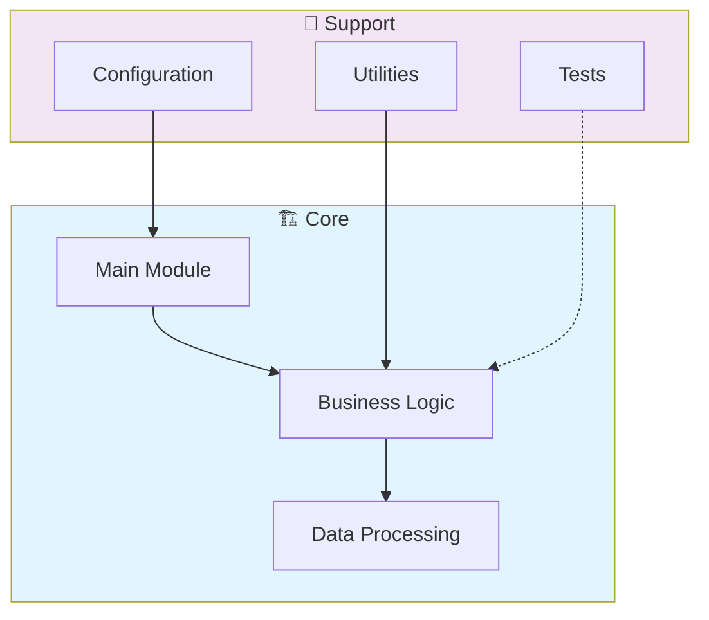
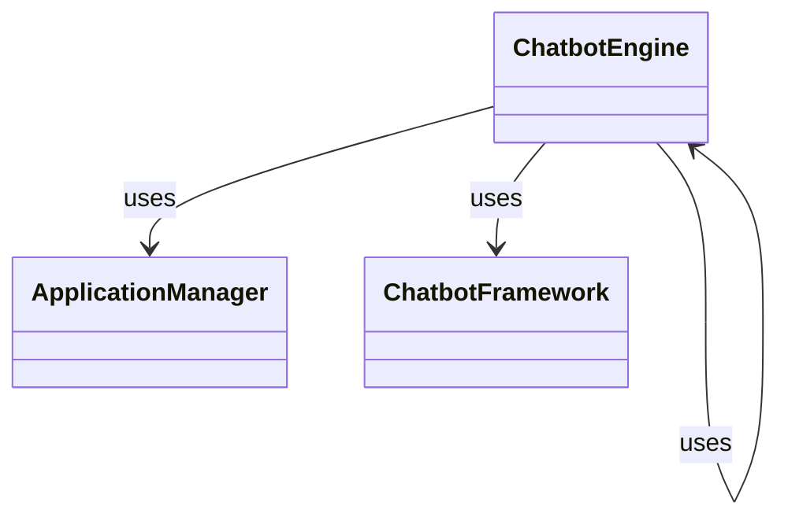

# 🤖 Ai Chatbot Framework

> Professional project by Gabriel Demetrios Lafis


[English](#english) | [Português](#português)

---

## English

### 🎯 Overview

**Ai Chatbot Framework** is a production-grade Python application complemented by CSS, HTML, JavaScript, R that showcases modern software engineering practices including clean architecture, comprehensive testing, containerized deployment, and CI/CD readiness.

The codebase comprises **2,192 lines** of source code organized across **12 modules**, following industry best practices for maintainability, scalability, and code quality.

### ✨ Key Features

- **🤖 ML Pipeline**: End-to-end machine learning workflow from data to deployment
- **🔬 Feature Engineering**: Automated feature extraction and transformation
- **📊 Model Evaluation**: Comprehensive metrics and cross-validation
- **🚀 Model Serving**: Production-ready prediction API
- **🐳 Containerized**: Docker support for consistent deployment
- **🏗️ Object-Oriented**: 4 core classes with clean architecture

### 🏗️ Architecture


```mermaid
graph TB
    subgraph Core["🏗️ Core"]
        A[Main Module]
        B[Business Logic]
        C[Data Processing]
    end
    
    subgraph Support["🔧 Support"]
        D[Configuration]
        E[Utilities]
        F[Tests]
    end
    
    A --> B --> C
    D --> A
    E --> B
    F -.-> B
    
    style Core fill:#e1f5fe
    style Support fill:#f3e5f5
```


```mermaid
classDiagram
    class ChatbotEngine
    class ApplicationManager
    class ChatbotFramework
    ChatbotEngine --> ChatbotEngine : uses
    ChatbotEngine --> ApplicationManager : uses
    ChatbotEngine --> ChatbotFramework : uses
```

### 🚀 Quick Start

#### Prerequisites

- Python 3.12+
- pip (Python package manager)

#### Installation

```bash
# Clone the repository
git clone https://github.com/galafis/AI-Chatbot-Framework.git
cd AI-Chatbot-Framework

# Create and activate virtual environment
python -m venv venv
source venv/bin/activate  # On Windows: venv\Scripts\activate

# Install dependencies
pip install -r requirements.txt
```

#### Running

```bash
# Run the application
python src/app.py
```

### 🧪 Testing

```bash
# Run all tests
pytest

# Run with coverage report
pytest --cov --cov-report=html

# Run specific test module
pytest tests/test_main.py -v

# Run with detailed output
pytest -v --tb=short
```

### 📁 Project Structure

```
AI-Chatbot-Framework/
├── assets/
│   └── data/
├── config/        # Configuration
│   ├── LICENSE
│   ├── config.py
│   ├── package.json
│   └── requirements.txt
├── docs/          # Documentation
│   └── app.js
├── src/          # Source code
│   ├── analytics.R
│   ├── app.js
│   ├── app.py
│   └── chatbot.js
├── tests/         # Test suite
│   └── test_app.py
├── Dockerfile
├── LICENSE
└── README.md
```

### 🛠️ Tech Stack

| Technology | Description | Role |
|------------|-------------|------|
| **Python** | Core Language | Primary |
| **Docker** | Containerization platform | Framework |
| JavaScript | 3 files | Supporting |
| HTML | 3 files | Supporting |
| CSS | 2 files | Supporting |
| R | 1 files | Supporting |

### 🤝 Contributing

Contributions are welcome! Please feel free to submit a Pull Request. For major changes, please open an issue first to discuss what you would like to change.

1. Fork the project
2. Create your feature branch (`git checkout -b feature/AmazingFeature`)
3. Commit your changes (`git commit -m 'Add some AmazingFeature'`)
4. Push to the branch (`git push origin feature/AmazingFeature`)
5. Open a Pull Request

### 📄 License

This project is licensed under the MIT License - see the [LICENSE](LICENSE) file for details.

### 👤 Author

**Gabriel Demetrios Lafis**
- GitHub: [@galafis](https://github.com/galafis)
- LinkedIn: [Gabriel Demetrios Lafis](https://linkedin.com/in/gabriel-demetrios-lafis)

---

## Português

### 🎯 Visão Geral

**Ai Chatbot Framework** é uma aplicação Python de nível profissional, complementada por CSS, HTML, JavaScript, R que demonstra práticas modernas de engenharia de software, incluindo arquitetura limpa, testes abrangentes, implantação containerizada e prontidão para CI/CD.

A base de código compreende **2,192 linhas** de código-fonte organizadas em **12 módulos**, seguindo as melhores práticas do setor para manutenibilidade, escalabilidade e qualidade de código.

### ✨ Funcionalidades Principais

- **🤖 ML Pipeline**: End-to-end machine learning workflow from data to deployment
- **🔬 Feature Engineering**: Automated feature extraction and transformation
- **📊 Model Evaluation**: Comprehensive metrics and cross-validation
- **🚀 Model Serving**: Production-ready prediction API
- **🐳 Containerized**: Docker support for consistent deployment
- **🏗️ Object-Oriented**: 4 core classes with clean architecture

### 🏗️ Arquitetura


```mermaid
graph TB
    subgraph Core["🏗️ Core"]
        A[Main Module]
        B[Business Logic]
        C[Data Processing]
    end
    
    subgraph Support["🔧 Support"]
        D[Configuration]
        E[Utilities]
        F[Tests]
    end
    
    A --> B --> C
    D --> A
    E --> B
    F -.-> B
    
    style Core fill:#e1f5fe
    style Support fill:#f3e5f5
```

### 🚀 Início Rápido

#### Prerequisites

- Python 3.12+
- pip (Python package manager)

#### Installation

```bash
# Clone the repository
git clone https://github.com/galafis/AI-Chatbot-Framework.git
cd AI-Chatbot-Framework

# Create and activate virtual environment
python -m venv venv
source venv/bin/activate  # On Windows: venv\Scripts\activate

# Install dependencies
pip install -r requirements.txt
```

#### Running

```bash
# Run the application
python src/app.py
```

### 🧪 Testing

```bash
# Run all tests
pytest

# Run with coverage report
pytest --cov --cov-report=html

# Run specific test module
pytest tests/test_main.py -v

# Run with detailed output
pytest -v --tb=short
```

### 📁 Estrutura do Projeto

```
AI-Chatbot-Framework/
├── assets/
│   └── data/
├── config/        # Configuration
│   ├── LICENSE
│   ├── config.py
│   ├── package.json
│   └── requirements.txt
├── docs/          # Documentation
│   └── app.js
├── src/          # Source code
│   ├── analytics.R
│   ├── app.js
│   ├── app.py
│   └── chatbot.js
├── tests/         # Test suite
│   └── test_app.py
├── Dockerfile
├── LICENSE
└── README.md
```

### 🛠️ Stack Tecnológica

| Tecnologia | Descrição | Papel |
|------------|-----------|-------|
| **Python** | Core Language | Primary |
| **Docker** | Containerization platform | Framework |
| JavaScript | 3 files | Supporting |
| HTML | 3 files | Supporting |
| CSS | 2 files | Supporting |
| R | 1 files | Supporting |

### 🤝 Contribuindo

Contribuições são bem-vindas! Sinta-se à vontade para enviar um Pull Request.

### 📄 Licença

Este projeto está licenciado sob a Licença MIT - veja o arquivo [LICENSE](LICENSE) para detalhes.

### 👤 Autor

**Gabriel Demetrios Lafis**
- GitHub: [@galafis](https://github.com/galafis)
- LinkedIn: [Gabriel Demetrios Lafis](https://linkedin.com/in/gabriel-demetrios-lafis)
